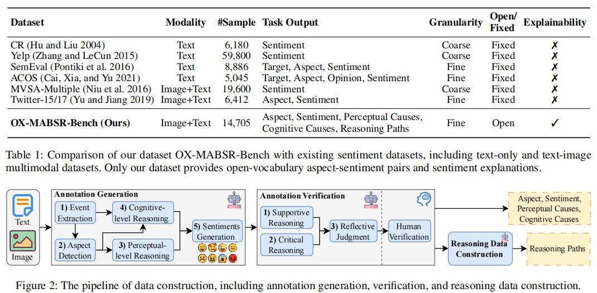
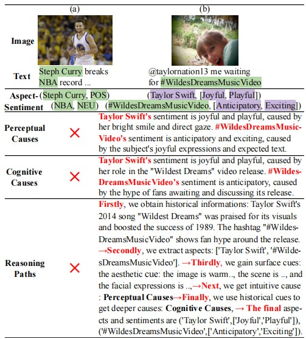

# OX-MABSR
Paper OX-MABSR: A Benchmark for Open-domain Explainable Multimodal Aspect-Based Sentiment Reasoning's (AAAI 2026) code and data

# Data Link
https://drive.google.com/drive/folders/1ayN8fIQF1aLegnNIVM8pFiegRI8BQKMo?usp=sharing
 
## Data

